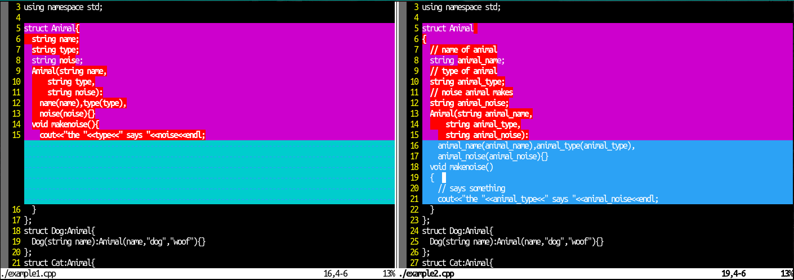
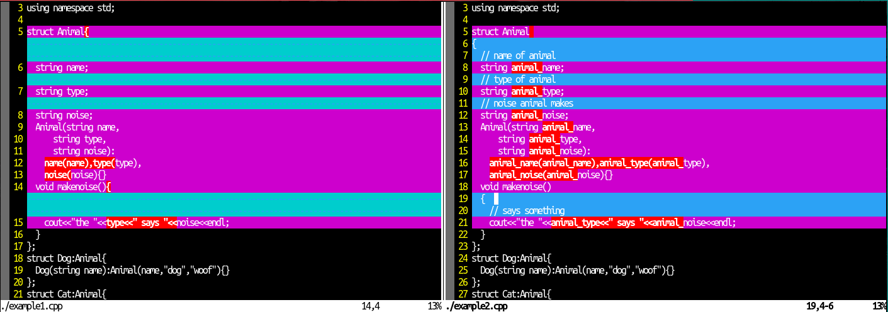
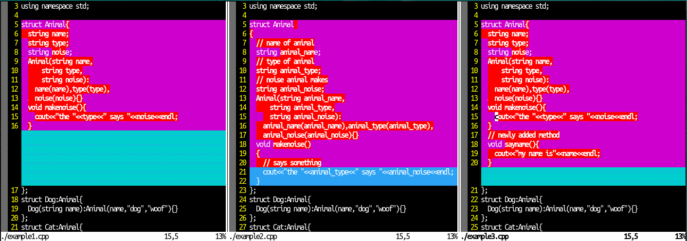
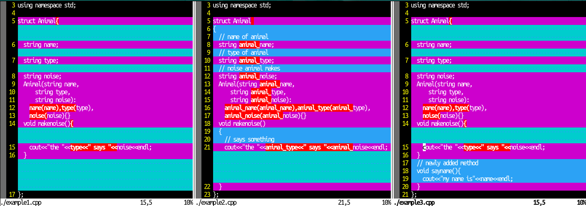
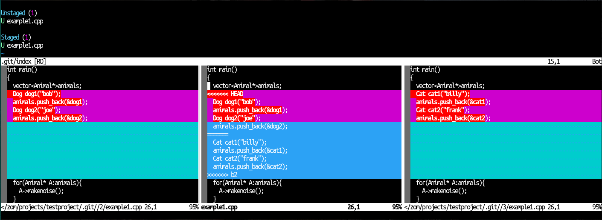
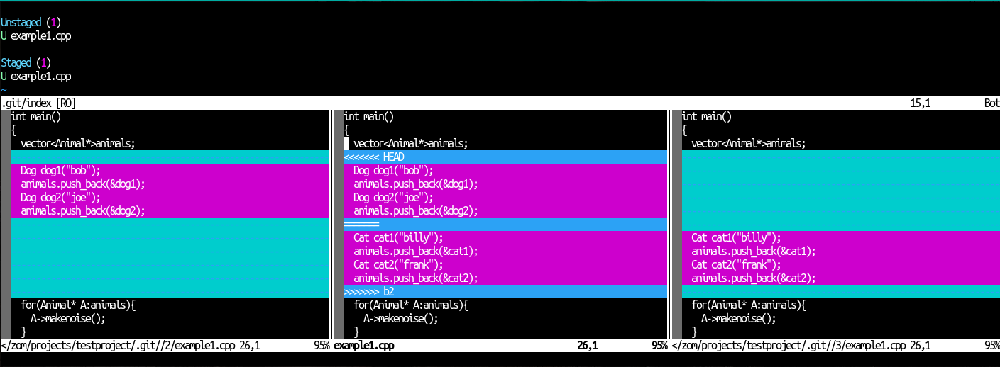
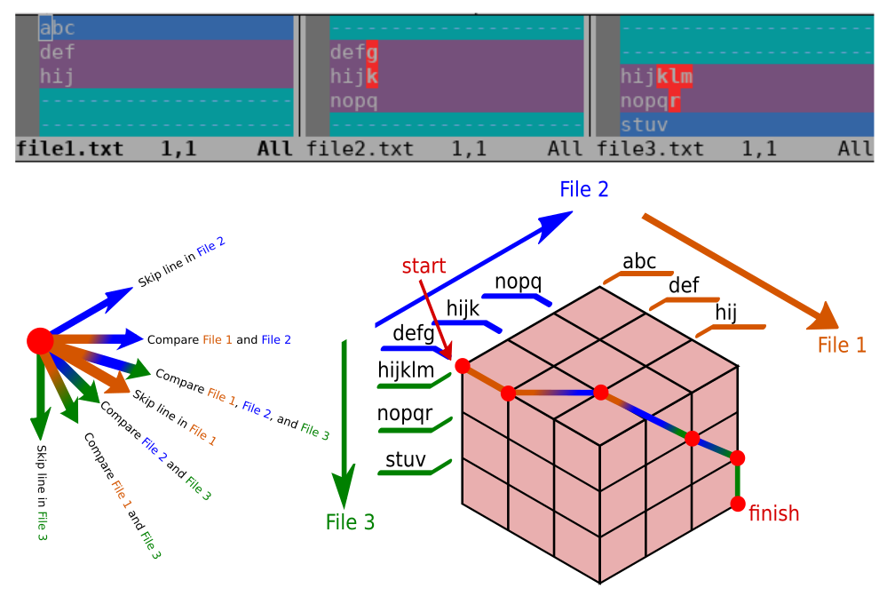
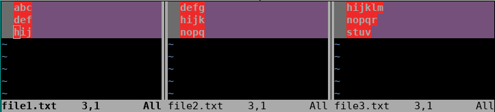
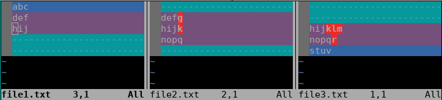

## linematch diff mode: Improved Diff Mode Fork for neovim

This fork was created to improve the diff mode of neovim to show more useful
information when comparing lines between files in diff view. Line comparisons
are made in a more useful way to show which lines are actually being added,
changed, and deleted.

## 2 files Before:
  

## 2 files After:
  

## 3 files Before:
  

## 3 files After:
  

## Fugitive merge conflict before:
  

## Fugitive merge conflict after:
  

## How to use:
enable this enhanced diff mode by using :set diffopt+=linematch:{n}. Where n is
the maximum total number of lines of the diff hunk. The line match diff opt is
disabled automatically when diffing more than three files at once. A reasonable
setting is ":set diffopt+=linematch:50", this will align the most similar lines
for a diff hunk in two buffers, 25 lines long in each, or a diff hunk between 3
files, 20 lines, 20 lines, and 10 lines. The limit is placed to prevent lag when
a very diff hunk is present, in the case that the specified line number is
exceeded, the default diff behaviour is resumed.

## Why is this not a plugin?
This may be able to be converted to a plugin, but doing so would take much more
work because the original diff mode would first need to be completely hidden.
All the locations with diffs would need to be overwritten with the text from the
linematch diff output. This would include writing text over locations which are
marked as filler lines, which I don't believe is possible to do. Changing lines
would need to be done on different "fake lines", because part of the
functionality here moves around the lines to align them between the diff
buffers. Additionally, By default the diff mode in vim is very bad compared to
other editors like Emacs and vs-code, so by default VIM should have a comparable
high quality diff view because other editors do.

## How it works:
  

## before:
  

## after:
  

The 3d case (for 3 buffers) of the algorithm implemented when diffopt
'linematch' is enabled. The algorithm constructs a 3d tensor to compare a diff
between 3 buffers. The dimmensions of the tensor are the length of the diff in
each buffer plus 1 A path is constructed by moving from one edge of the cube/3d
tensor to the opposite edge.  Motions from one cell of the cube to the next
represent decisions. In a 3d cube, there are a total of 7 decisions that can be
made, represented by the enum path3_choice which is defined in buffer_defs.h a
comparison of buffer 0 and 1 represents a motion toward the opposite edge of the
cube with components along the 0 and 1 axes.  a comparison of buffer 0, 1, and 2
represents a motion toward the opposite edge of the cube with components along
the 0, 1, and 2 axes. A skip of buffer 0 represents a motion along only the 0
axis. For each action, a point value is awarded, and the path is saved for
reference later, if it is found to have been the optimal path. The optimal path
has the highest score.
The score is calculated as the summation of the total characters matching
between all of the lines which were compared. The structure of the algorithm is
that of a dynamic programming problem.  We can calculate a point i,j,k in the
cube as a function of i-1, j-1, and k-1. To find the score and path at point
i,j,k, we must determine which path we want to use, this is done by looking at
the possibilities and choosing the one which results in the local highest score.
The total highest scored path is, then in the end represented by the cell in the
opposite corner from the start location.
The entire algorithm consits of populating the 3d cube with the optimal paths
from which it may have came.  However, we cannot apply the general 3d case
before first populating the edges and the surfaces of the cube. Therefore, there
are several sets of if / else statements inside the main loops which determine
which case to evaluate.

## optimizations
As the function to calculate the cell of a tensor at point i,j,k is a function
of the cells at i-1, j-1, k-1, the whole tensor doesn't need to be stored in
memory at once. In the case of the 3d cube, only slices (along k and j axis) are
stored in memory. For the 2d matrix (for 2 files), only two rows are stored at a
time.

In the 3d case, 3 arrays are populated to memorize the score (matched
characters) of the 3 buffers, so a redundant calculation of the scores does not
occur

## original neovim documentation:
[](https://neovim.io)

[Documentation](https://neovim.io/doc) |
[Chat](https://gitter.im/neovim/neovim) |
[Twitter](https://twitter.com/Neovim)

[](https://github.com/neovim/neovim/actions?query=workflow%3A%22CI%22)
[](https://codecov.io/gh/neovim/neovim)
[](https://scan.coverity.com/projects/2227)
[](https://neovim.io/doc/reports/clang)
[](https://neovim.io/doc/reports/pvs/PVS-studio.html.d)

[](https://repology.org/metapackage/neovim)
[](https://buildd.debian.org/neovim)
[](https://github.com/neovim/neovim/releases/)
[](https://snapcraft.io/nvim)

Neovim is a project that seeks to aggressively refactor Vim in order to:

- Simplify maintenance and encourage [contributions](CONTRIBUTING.md)
- Split the work between multiple developers
- Enable [advanced UIs] without modifications to the core
- Maximize [extensibility](https://github.com/neovim/neovim/wiki/Plugin-UI-architecture)

See the [Introduction](https://github.com/neovim/neovim/wiki/Introduction) wiki page and [Roadmap]
for more information.

Features
--------

- Modern [GUIs](https://github.com/neovim/neovim/wiki/Related-projects#gui)
- [API access](https://github.com/neovim/neovim/wiki/Related-projects#api-clients)
  from any language including C/C++, C#, Clojure, D, Elixir, Go, Haskell, Java,
  JavaScript/Node.js, Julia, Lisp, Lua, Perl, Python, Racket, Ruby, Rust
- Embedded, scriptable [terminal emulator](https://neovim.io/doc/user/nvim_terminal_emulator.html)
- Asynchronous [job control](https://github.com/neovim/neovim/pull/2247)
- [Shared data (shada)](https://github.com/neovim/neovim/pull/2506) among multiple editor instances
- [XDG base directories](https://github.com/neovim/neovim/pull/3470) support
- Compatible with most Vim plugins, including Ruby and Python plugins

See [`:help nvim-features`][nvim-features] for the full list!

Install from package
--------------------

Pre-built packages for Windows, macOS, and Linux are found on the
[Releases](https://github.com/neovim/neovim/releases/) page.

[Managed packages] are in [Homebrew], [Debian], [Ubuntu], [Fedora], [Arch Linux],
[Gentoo], and more!

Install from source
-------------------

The build is CMake-based, but a Makefile is provided as a convenience.

    make CMAKE_BUILD_TYPE=RelWithDebInfo
    sudo make install

To install to a non-default location:

    make CMAKE_INSTALL_PREFIX=/full/path/
    make install

To skip bundled (`third-party/*`) dependencies:

1. Install the dependencies using a package manager.
   ```
   sudo apt install gperf luajit luarocks libuv1-dev libluajit-5.1-dev libunibilium-dev libmsgpack-dev libtermkey-dev libvterm-dev libutf8proc-dev
   sudo luarocks build mpack
   sudo luarocks build lpeg
   sudo luarocks build inspect
   ```
2. Build with `USE_BUNDLED=OFF`:
   ```
   make CMAKE_BUILD_TYPE=RelWithDebInfo USE_BUNDLED=OFF
   sudo make install
   ```

To inspect the build, these CMake features are useful:

- `cmake --build build --target help` lists all build targets.
- `build/CMakeCache.txt` (or `cmake -LAH build/`) contains the resolved values of all CMake variables.
- `build/compile_commands.json` shows the full compiler invocations for each translation unit.

See the [Building Neovim](https://github.com/neovim/neovim/wiki/Building-Neovim) wiki page for details.

Transitioning from Vim
--------------------

See [`:help nvim-from-vim`](https://neovim.io/doc/user/nvim.html#nvim-from-vim) for instructions.

Project layout
--------------

    ├─ ci/              build automation
    ├─ cmake/           build scripts
    ├─ runtime/         user plugins/docs
    ├─ src/nvim/        application source code (see src/nvim/README.md)
    │  ├─ api/          API subsystem
    │  ├─ eval/         VimL subsystem
    │  ├─ event/        event-loop subsystem
    │  ├─ generators/   code generation (pre-compilation)
    │  ├─ lib/          generic data structures
    │  ├─ lua/          Lua subsystem
    │  ├─ msgpack_rpc/  RPC subsystem
    │  ├─ os/           low-level platform code
    │  └─ tui/          built-in UI
    ├─ third-party/     CMake subproject to build dependencies
    └─ test/            tests (see test/README.md)

License
-------

Neovim contributions since [b17d96][license-commit] are licensed under the
Apache 2.0 license, except for contributions copied from Vim (identified by the
`vim-patch` token). See LICENSE for details.

    Vim is Charityware.  You can use and copy it as much as you like, but you are
    encouraged to make a donation for needy children in Uganda.  Please see the
    kcc section of the vim docs or visit the ICCF web site, available at these URLs:

            http://iccf-holland.org/
            http://www.vim.org/iccf/
            http://www.iccf.nl/

    You can also sponsor the development of Vim.  Vim sponsors can vote for
    features.  The money goes to Uganda anyway.

[license-commit]: https://github.com/neovim/neovim/commit/b17d9691a24099c9210289f16afb1a498a89d803
[nvim-features]: https://neovim.io/doc/user/vim_diff.html#nvim-features
[Roadmap]: https://neovim.io/roadmap/
[advanced UIs]: https://github.com/neovim/neovim/wiki/Related-projects#gui
[Managed packages]: https://github.com/neovim/neovim/wiki/Installing-Neovim#install-from-package
[Debian]: https://packages.debian.org/testing/neovim
[Ubuntu]: http://packages.ubuntu.com/search?keywords=neovim
[Fedora]: https://apps.fedoraproject.org/packages/neovim
[Arch Linux]: https://www.archlinux.org/packages/?q=neovim
[Gentoo]: https://packages.gentoo.org/packages/app-editors/neovim
[Homebrew]: https://formulae.brew.sh/formula/neovim

<!-- vim: set tw=80: -->
